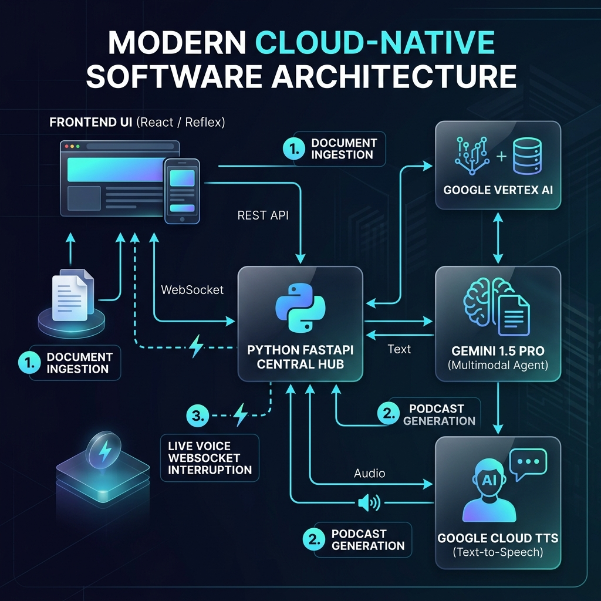

# Copilot Live Financial Podcast MVP

This repository contains the lightweight MVP of the Copilot Terminal demo, built for public demonstration. It is designed to run locally, allowing users to upload a financial document, generate a synthetic two-speaker financial podcast summarizing the document, and seamlessly interrupt the podcast using their microphone to "talk live" with the host (Jane) via the Gemini Multimodal Live API.

## 🌟 Recent Architecture Updates
To optimize the workspace for a clean, public-facing demonstration, the backend has been thoroughly scrubbed and modularized:
- **Pruned Dead Code**: All proprietary integrations, FactSet SDK mocking, YouTube/Video parsing agents, and obsolete background caching loops have been entirely removed.
- **Slimmed `app.py`**: The core FastAPI application is now a clean, minimal hub (<200 lines) dedicated purely to wiring together external routers.
- **Modularized Endpoints**: The Podcast Generator and WebRTC Live Voice WebSocket logic have been extracted into dedicated API Routers (`podcast_router.py` and `live_agent.py`).
- **Unified Master Dashboard**: The complex "persona" navigation and sub-routing have been flattened into a single, cohesive view (`financial_dashboard.py`).
- **Brand Scrubbing**: All explicit customer branding has been generalized (e.g., using "Factchecker" and "Platform Signal").

## 🚀 Setting Up the Google Cloud Project ID

To run the Podcast Generator and Gemini Live Agent, you must authenticate to a Google Cloud Project with the Vertex AI and Text-to-Speech APIs enabled. 

In `app.py` and `podcast_tools.py`, the environment expects the following:
```python
os.environ["GOOGLE_CLOUD_PROJECT"] = "YOUR_GCP_PROJECT_ID"
os.environ["GOOGLE_CLOUD_LOCATION"] = "global"  
os.environ["GOOGLE_GENAI_USE_VERTEXAI"] = "1"
```
**CRITICAL:** Ensure your default authentication strategy supports access to the target Vertex AI project. Replace `YOUR_GCP_PROJECT_ID` with the actual GCP project ID prior to deploying or running the application locally.

## 🔄 System Architecture



This premium architecture diagram illustrates the secure, cloud-native connection between the React/Reflex frontend, the Python FastAPI central hub, and the Google Cloud AI primitives (Gemini 1.5 Pro and Google Vertex TTS) powering the document ingestion, podcast generation, and WebRTC live voice interruption flows.

## 📂 Architecture & Folder Structure

```text
copilot-workspace/
│
├── app.py                      # 🌟 KEY MVP FILE: Main minimal FastAPI server hub. Wires up agents and registers external API routers.
├── pyproject.toml              # Python dependency file for `uv`.
│
├── agent/                      # 🧠 THE AI BACKEND
│   ├── core/
│   │   ├── agent_router.py     # Initializes the offline foundational LLMs (News & Synthesizer) for dashboard parsing.
│   │   ├── podcast_router.py   # Dedicated FastAPI router handling the dynamic /generate-audio 2-speaker pipeline.
│   │   ├── live_agent.py       # 🌟 KEY MVP FILE: Dedicated router handling the WebRTC/WebSocket loop for "Interrupt & Discuss Live".
│   │   └── prompts.py          # Centralized configuration defining system prompts, JSON formatting, and persona nudges.
│   └── tools/
│       └── podcast_tools.py    # 🌟 KEY MVP FILE: The core logic triggering Gemini script generation and concurrent TTS audio synthesis.
│
└── client/                     # 🖥️ THE REFLEX FRONTEND
    ├── rxconfig.py             # Reflex configuration.
    ├── assets/                 # Where the generated `podcast*.wav` audio files are stored and served.
    └── copilot_client/
        ├── copilot_client.py   # The master root layout configuration for the browser app.
        ├── core/
        │   └── state.py        # Brain of the frontend. Manages variables, button clicks, and WebSocket payloads.
        └── components/
            ├── financial_dashboard.py  # The unified, single-page dashboard containing all charts and metrics.
            ├── shared.py               # Houses the elevated Hero Widgets (Audio Player, Document Upload).
            └── chat_interface.py       # The persistent text-based chat interface.
```

## 🛠️ How to Run the Application Locally

You need to run both the FastAPI Backend and the Reflex Frontend simultaneously. Open two separate terminal windows inside this workspace directory.

**Terminal 1: Start the AI Backend**
```bash
uv run app.py
```
*This will boot `uvicorn` and host the core API and Websockets on `http://127.0.0.1:8080`.*

**Terminal 2: Start the Reflex Frontend**
```bash
cd client
uv run reflex run
```
*Reflex will compile the UI and launch a browser window typically at `http://localhost:3000`.*

## 🎬 How to Use the Demo

Once both the backend and frontend are actively running, follow these steps to experience the MVP:

1. **Upload a Document**: Open the frontend in your browser (`http://localhost:3000`). Locate the Document Upload widget at the top of the interface and upload a financial PDF or text document.
2. **Generate the Podcast**: Click the **"Generate Podcast from Document!"** button. The backend AI will parse your document, write a dynamic 2-speaker radio script, and synthesize the realistic audio. Once complete, an audio player will appear in the UI.
3. **Listen & Review**: Hit play on the audio player to listen to Joe and Jane discuss the key insights from your document.
4. **Interrupt & Discuss Live**: At any point during the podcast, click the **"Interrupt & Discuss Live"** button. The podcast audio will pause, and your browser's microphone will activate. Speak out loud to Jane—ask her a question about the insights, tell her to pull up a different dashboard view, or ask her to clarify a complicated point. She will respond in real-time, accurately aware of what podcast script you were just listening to!
